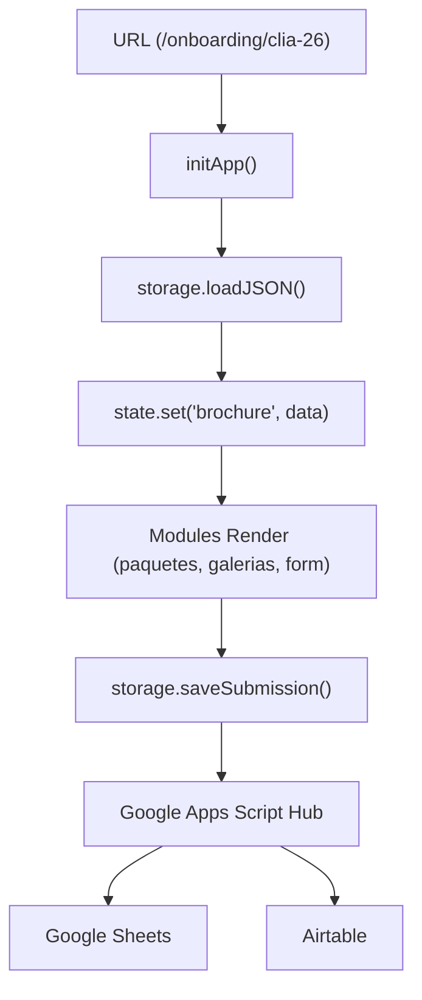

# Arquitectura — Mi Mejor Retrato School Proposals

## Principio central

> El sistema no tiene archivos HTML por colegio en onboarding. Un solo `index.html` lee la URL para saber qué datos mostrar. En propuestas, se mantiene una estructura híbrida optimizada para máxima velocidad y conversión.

Un solo HTML funciona para cualquier escuela/año en onboarding porque **todo el contenido se define en los JSONs**. En el brochure de propuestas (`/propuesta/`), se utiliza un modelo **híbrido** de alto desempeño.

---

## Capas del sistema

Existen dos modalidades principales en la aplicación:
1. **Onboarding Pre-Sesión (B2C)**: Completamente montado vía Javascript (Dynamic Layout).
2. **Propuesta Comercial (B2B)**: Usa un modelo **Híbrido Estático/Dinámico** (HTML fijo inyectando datos).

### Arquitectura Onboarding B2C (Dinámica)
```
┌─────────────────────────────────────────────────────┐
│                   HTML (View)                        │
│                   index.html                         │
│  — Único punto de entrada                            │
│  — Estructura semántica + placeholders               │
│  — NO lógica de negocio, NO fetch directo            │
└──────────────────────┬──────────────────────────────┘
```

### Arquitectura Propuesta B2B (Híbrida)
```
┌─────────────────────────────────────────────────────┐
│                   HTML (View)                        │
│                   propuesta/index.html               │
│  — Mantiene copy, FAQ, logística y tabla estática    │
│  — Inyecta precios, escuela y año vía app.js         │
│  — Diseño Mobile-First con variables CSS en :root    │
│  — Enfocada en SEO, LLMs y carga veloz               │
└─────────────────────────────────────────────────────┘
```
                       │ llama a
┌──────────────────────▼──────────────────────────────┐
│                   MÓDULOS (/modules)                  │
│  form-renderer.js  paquetes.js  galerias.js          │
│  secciones.js      ubicacion.js  analytics.js        │
│  — Renderizado de UI                                  │
│  — Leen de state, llaman a storage                   │
└──────────────────────┬──────────────────────────────┘
                       │ usa
┌──────────────────────▼──────────────────────────────┐
│                   ESTADO (lib/state.js)               │
│  — Store centralizado en memoria                     │
│  — Fuente de verdad en runtime                       │
│  — Sin reactividad compleja                          │
└──────────────────────┬──────────────────────────────┘
                       │ poblado por
┌──────────────────────▼──────────────────────────────┐
│              PERSISTENCIA (lib/storage.js)            │
│  — ÚNICO punto de acceso a datos externos            │
│  — Adapter pattern: POST a Google Sheets & Discord   │
└──────────────────────┬──────────────────────────────┘
                       │ lee / escribe
┌──────────────────────▼──────────────────────────────┐
│                   DATOS & BACKEND                    │
│  DATOS (JSON): escuelas, precios, secciones          │
│  BACKEND: Google Sheets (DB) + Discord (Alertas)     │
└─────────────────────────────────────────────────────┘
```

---

## 🎨 Sistema de Diseño CSS & Tokens (`propuesta/css/style.css`)
Las propuestas utilizan un sistema de diseño mobile-first sustentado en variables CSS (`:root`):
* **Tipografías Editoriales**: `Playfair Display` (serif estilizado para headings con itálicas expresivas) y `Outfit` (sans-serif moderno para lectura).
* **Paleta Cálida Neutra**:
  * `--color-paper-warm` (`#FBF9F6`) - Fondo orgánico y suave.
  * `--color-accent` (`#C8622A`) - Terracota cálido de marca.
  * `--color-accent-light` (`#F2E8E0`) - Fondo suave para áreas destacadas.
  * `--color-ink` (`#2A2724`) - Negro carbón de gran contraste para lectura.
* **Componentes Robustos**:
  * **Tabla Comparativa**: Contenedor horizontal con scroll nativo (`.pricing-table-wrapper`) que no altera las filas, manteniendo visualización impecable sin desbordamientos de columnas en pantallas pequeñas.
  * **Línea de Tiempo**: Bloques sencillos y limpios que mantienen su alineación y altura fluidamente.

---

## 🏗️ Estructura del Core Unificado (`js/core/`)

Para evitar duplicidad y asegurar que un cambio en la configuración (ej: endpoints o WhatsApp) se refleje en todo el sitio, hemos centralizado la lógica en la raíz del proyecto:

* **`config.js`**: Única fuente de verdad para endpoints, feature flags y textos de marca.
* **`state.js`**: Observable Store centralizado.
* **`storage.js`**: Adaptador de persistencia y carga de JSONs con caché de memoria.
* **`api.js`**: Hub de comunicaciones externas (Google Sheets Hub y Discord).
* **`validators.js`** / **`utils.js`**: Librerías de lógica pura compartidas.

---

## 🔄 Flujo de Datos (Onboarding B2C)



---

## La regla más importante

**La UI nunca toca localStorage ni fetch directamente.**

```javascript
// ✅ CORRECTO — todo pasa por storage y api
const precios = await storage.loadJSON('precios.json');
await storage.saveSubmission(formData, metadata);

// ❌ PROHIBIDO — acoplamiento directo
localStorage.setItem('data', JSON.stringify(data));
const res = await fetch('/data/precios.json');
```

---

## Inicialización de Google Analytics en Propuestas B2B

Para mantener la velocidad y optimizar la carga del brochure comercial, se implementó la etiqueta oficial de **Google Analytics 4 (GA4)** de forma estática y comentada en el HTML.

### Flujo de Monitoreo Multi-Colegio
El sistema consolida el rastreo mediante una sola propiedad GA4:
1. El usuario navega a la URL específica del colegio (ej: `/propuesta/index.html?brochure=lasa-26`).
2. La etiqueta de GA4 captura el `page_location` automáticamente.
3. Se puede inyectar dinámicamente el parámetro `school_slug` en la llamada a `gtag` para crear dimensiones personalizadas que faciliten la analítica consolidada y reportes de conversión específicos por colegio de forma ágil y centralizada.
