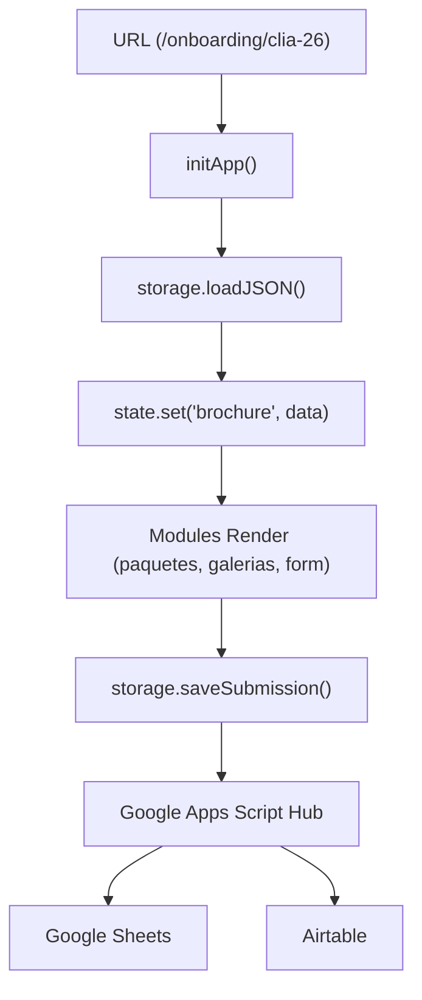

# Arquitectura — Mi Mejor Retrato School Proposals

## Principio central

> El sistema no tiene archivos HTML por colegio en onboarding. Un solo `index.html` lee la URL para saber qué datos mostrar. En propuestas, se mantiene una estructura híbrida optimizada para máxima velocidad y conversión.

Un solo HTML funciona para cualquier escuela/año en onboarding porque **todo el contenido se define en los JSONs**. En el brochure de propuestas (`/propuesta/`), se utiliza un modelo **híbrido** de alto desempeño.

---

## Capas del sistema y Enrutamiento Limpio

El ecosistema expone tres puntos de contacto principales:
1. **Onboarding Pre-Sesión (B2C)**: Completamente dinámico vía `/onboarding/index.html` (Dynamic Layout).
2. **Propuesta Comercial (B2B)**: Modelo híbrido estático/dinámico en `/propuesta/index.html`.
3. **Página de Familias B2C (URLs Limpias)**: `/familias/:slug` (que apunta físicamente a `/familias/index.html` mediante Vercel rewrites). Esta página comparte la lógica y estilos de la propuesta comercial (`/propuesta/js/app.js` y `/propuesta/css/style.css`) mediante rutas absolutas de recursos, pero ofrece un llamado a la acción (CTA) adaptado para coordinar con las familias de un salón.

### Arquitectura de Enrutamiento Limpio (`vercel.json`)
Para evitar URLs complejas o directorios físicos repetidos por cada colegio, se utiliza un motor de enrutamiento basado en rewrites y redirects en Vercel:
* **Rewrites:** Las solicitudes a `/familias/:slug` (ej: `/familias/lasa-26`) y `/propuesta/:slug` se reescriben internamente a sus respectivos archivos index (ej: `/familias/index.html` y `/propuesta/index.html`).
* **Redirects (301):** Para asegurar una sola versión canonical de la URL, las visitas a rutas con extensión `.html` (ej: `/familias/lasa-26.html`) se redirigen permanentemente (301) a su versión limpia `/familias/lasa-26`.
* **Compatibilidad local:** En el entorno local (`Live Server`), la extracción del ID del colegio (`schoolId`) es compatible tanto con la URL limpia como con el fallback de parámetros query (`?co=lasa-26` o `?brochure=lasa-26`).

### Arquitectura Onboarding B2C (Dinámica)
```
┌─────────────────────────────────────────────────────┐
│                   HTML (View)                        │
│                   index.html                         │
│  — Único punto de entrada                            │
│  — Estructura semántica + placeholders               │
│  — NO lógica de negocio, NO fetch directo            │
└──────────────────────┬──────────────────────────────┘
```

### Arquitectura Propuesta B2B & Familias B2C (Híbrida/Dinámica)
```
┌─────────────────────────────────────────────────────┐
│              HTML (propuesta/familias)               │
│        propuesta/index.html & familias/index.html   │
│  — Mantienen estructura base, FAQs y CDN de estilos  │
│  — Inyectan precios, escuelas y galerías dinámicas  │
│  — `/familias` tiene CTA dual (B2B/B2C onboarding)   │
└──────────────────────┬──────────────────────────────┘
```
                       │ llama a
┌──────────────────────▼──────────────────────────────┐
│                   MÓDULOS (/modules)                  │
│  form-renderer.js  paquetes.js  galerias.js          │
│  secciones.js      ubicacion.js  analytics.js        │
│  — Renderizado de UI                                  │
│  — Leen de state, llaman a storage                   │
│  — paquetes.js ahora renderiza una tabla comparativa  │
│    idéntica a la propuesta comercial (Unified UX)    │
└──────────────────────┬──────────────────────────────┘
                       │ usa
┌──────────────────────▼──────────────────────────────┐
│                   ESTADO (lib/state.js)               │
│  — Store centralizado en memoria                     │
│  — Fuente de verdad en runtime                       │
│  — Sin reactividad compleja                          │
└──────────────────────┬──────────────────────────────┘
                       │ poblado por
┌──────────────────────▼──────────────────────────────┐
│              PERSISTENCIA (lib/storage.js)            │
│  — ÚNICO punto de acceso a datos externos            │
│  — Adapter pattern: POST a Google Sheets & Discord   │
└──────────────────────┬──────────────────────────────┘
                       │ lee / escribe
┌──────────────────────▼──────────────────────────────┐
│                   DATOS & BACKEND                    │
│  DATOS (JSON): precios, secciones, propuesta
│  — precios.json: Única Fuente de Verdad para la
│    identidad, visibilidad, precios, inclusiones y
│    fotos familiares
│  — {code}_propuesta.json: contenido B2B específico
│    por colegio (logística, diferenciadores, galería)
│  BACKEND: Google Sheets (DB + Tracker B2B) + Discord
└─────────────────────────────────────────────────────┘
```

---

## 📊 La Tabla Comparativa Unificada y Única Fuente de Verdad

Con el fin de eliminar la redundancia de precios (DRY), la tabla de precios comparativa se construye 100% dinámicamente desde `precios.json` en ambas modalidades (B2B propuesta y B2C onboarding).

### Estructura del JSON (`onboarding/data/precios.json`):
Cada paquete en una escuela activa (con `visibilidad: "publicar"`) expone un objeto `tabla_comparativa` que define exactamente qué se incluye:
```json
"tabla_comparativa": {
  "fotos_digitales": 6,
  "foto_grupal": true,
  "impresiones": "1 gr. + 4 peq.",
  "foto_enmarcada": null,
  "fotos_familiares": false,
  "ideal_para": "Variedad con foto impresa"
}
```
* **Flexibilidad Logística**: El campo `fotos_familiares` (booleano) permite desactivar dinámicamente las fotos con acudientes por escuela (ej: `false` en sesiones escolares en horas de clase de `lasa`, `enda` o `ebrv`, y `true` en sesiones de estudio independiente como `indp`).
* **Inserción Limpia en el DOM**: Para evitar que un contenedor intermedio rompa el comportamiento de `display: grid` en la tabla de 4 columnas, el JS inyecta las celdas directamente en el contenedor `.pt-grid` usando `insertAdjacentHTML('beforeend', ...)`. En el onboarding, se fuerza el contenedor contenedor principal a `display: block` para evitar el colapso del ancho debido al scroll horizontal (`overflow-x: auto`).

---

## 🎨 Sistema de Diseño CSS & Tokens (`propuesta/css/style.css`)
Las propuestas utilizan un sistema de diseño mobile-first sustentado en variables CSS (`:root`):
* **Tipografías Editoriales**: `Playfair Display` (serif estilizado para headings con itálicas expresivas) y `Outfit` (sans-serif moderno para lectura).
* **Paleta Cálida Neutra**:
  * `--color-paper-warm` (`#FBF9F6`) - Fondo orgánico y suave.
  * `--color-accent` (`#C8622A`) - Terracota cálido de marca.
  * `--color-accent-light` (`#F2E8E0`) - Fondo suave para áreas destacadas.
  * `--color-ink` (`#2A2724`) - Negro carbón de gran contraste para lectura.
* **Componentes Robustos**:
  * **Tabla Comparativa**: Contenedor horizontal con scroll nativo (`.pricing-table-wrapper`) que no altera las filas, manteniendo visualización impecable sin desbordamientos de columnas en pantallas pequeñas.
  * **Línea de Tiempo**: Bloques sencillos y limpios que mantienen su alineación y altura fluidamente.

---

## 🏗️ Estructura del Core Unificado (`js/core/`)

Para evitar duplicidad y asegurar que un cambio en la configuración (ej: endpoints o WhatsApp) se refleje en todo el sitio, hemos centralizado la lógica en la raíz del proyecto:

* **`config.js`**: Única fuente de verdad para endpoints, feature flags y textos de marca.
* **`state.js`**: Observable Store centralizado.
* **`storage.js`**: Adaptador de persistencia y carga de JSONs con caché de memoria.
* **`api.js`**: Hub de comunicaciones externas (Google Sheets Hub y Discord).
* **`validators.js`** / **`utils.js`**: Librerías de lógica pura compartidas.

---

## 📋 Tracker de Propuestas B2B (`onboarding/apps-script/MMR_brochures_hub_v4.0.gs` v4.2)

El Hub v4.2 incorpora un módulo de CRM interno para hacer seguimiento de las propuestas enviadas a directores/coordinadores de colegios. Opera de forma **independiente** del flujo B2C (padres de familia).

### Pestaña `Propuestas` en Google Sheets (CRM B2B)

| Columna | Campo | Automatización |
|---------|-------|----------------|
| A | Escuela | Manual |
| B | Código | Manual |
| C–F | Tipo, Zona, Modalidad, Grados | Manual |
| G–I | Contacto, Cargo, WhatsApp | Manual |
| J | Fecha envío | Auto — `marcarEnviadaHoy()` |
| K | Fecha seguimiento | Auto — J + 7 días |
| L | Estado | Auto inicial / actualización manual |
| M | Probabilidad | Manual (Alta / Media / Baja) |
| N | Notas | Manual |

### Funciones del módulo
* **`setupPropostasSheet()`**: Crea e inicializa la pestaña con formato, validaciones y anchos. Ejecutar una sola vez.
* **`marcarEnviadaHoy()`**: Acción de menú. Rellena J, K y cambia Estado a 🟡 Enviada en la fila seleccionada.
* **`verificarSeguimientos()`**: Trigger diario (8am). Colorea filas vencidas (🔴) o próximas (🟡) y envía resumen a Discord. Fallback a email.
* **`setupTrackerTrigger()`**: Registra el trigger diario una sola vez. Elimina duplicados automáticamente.

> ⚠️ **Restricción de contexto**: `getUi()` solo está disponible cuando la ejecución proviene del menú de Google Sheets. Las funciones de setup usan `Logger.log()` para ser compatibles con el editor de Apps Script.

### Recepción de Leads B2C (Onboarding)
El Hub también procesa el JSON entrante de las reservas creadas por los clientes B2C:
1. **Hoja Principal**: Anexa la fila con 16 columnas de datos, incluyendo logística y `Estudio` seleccionado (ubicación).
2. **Airtable**: Envía un payload POST sincronizando el lead con el CRM de Airtable y asegurando la consistencia demográfica.
3. **Logs**: Deja rastro de auditoría transaccional en la pestaña `Logs` por cada lead recibido.

---

## 🔄 Flujo de Datos (Onboarding B2C)



---

## La regla más importante

**La UI nunca toca localStorage ni fetch directamente.**

```javascript
// ✅ CORRECTO — todo pasa por storage y api
const precios = await storage.loadJSON('precios.json');
await storage.saveSubmission(formData, metadata);

// ❌ PROHIBIDO — acoplamiento directo
localStorage.setItem('data', JSON.stringify(data));
const res = await fetch('/data/precios.json');
```

---

## 📱 Herramientas Locales: Pulso (WhatsApp CRM)

El sistema incluye **Pulso** (`herramientas/wassap-crm`), un CRM local sin servidor que se encarga de la Fase inicial del embudo (Outreach). 

*   **Generación de Claves (student_id)**: Pulso limpia los números de teléfono e inyecta dinámicamente un `student_id` único en su variable `[link_onboarding]`.
*   **Persistencia Local**: Funciona exclusivamente con la File System Access API guardando estado en JSONs locales, garantizando la privacidad.
*   **Exportador CSV Nativo**: Se integró un menú personalizado en Google Sheets (`📤 Exportar para Pulso`) dentro del Google Apps Script Hub que formatea, mapea y descarga los leads directamente en el formato exacto de importación requerido por Pulso (Acudiente, Relación, Teléfono, Estudiante, Salón, Escuela).
*   **Flujo**: Onboarding recibe Leads -> Sheets agrupa y exporta CSV por Salón -> Pulso genera el link y campaña -> Acudiente abre el cuestionario de Discovery y luego selecciona Agenda.

---

## 🖨️ Herramientas Locales: Generador de Hojas de Ruta (Códigos QR)

El ecosistema cuenta con una herramienta web interna (`herramientas/generador_pdf/index.html`) para facilitar el flujo presencial el día de la sesión de fotos.

* **Arquitectura sin dependencias**: Single Page Application en HTML/JS vanilla que se ejecuta localmente.
* **Consumo Dinámico**: Se conecta al Google Apps Script Hub (`getStudents` y `getAgenda`) para descargar el roster de un salón y renderizarlo en pantalla.
* **Escaneo en Lightroom**: Genera en vivo mediante `qrcode.js` un Código QR de alto contraste por cada estudiante que contiene exclusivamente su clave primaria (`student_id`). Esto permite a la cámara leer el código y catalogar la sesión instantáneamente.
* **Diseño para Impresión**: Utiliza un bloque `@media print` para cambiar a un layout minimalista de alto contraste (fondo blanco, cero botones), empaquetando 4 estudiantes por hoja de tamaño carta (8.5x11).
* **Preparación para Orden**: Compatible con un sistema de orden secuencial. Lee la propiedad `secuencia_dia` desde Airtable para imprimir en qué orden exacto posará el estudiante frente a la cámara.

---

## 📄 Herramientas Locales: Generador de Perfiles Discovery

Ubicado en `herramientas/generador_perfiles/index.html`, permite imprimir las respuestas del cuestionario pre-sesión para todo un salón de un solo golpe.

* **Consumo Dinámico Paralelo**: El Hub v4.2 incluye un endpoint `getCuestionarios` que filtra la hoja de Google Sheets y retorna todas las respuestas de un salón específico. La UI combina esto con la configuración base de preguntas (`cuestionario_config.json`).
* **Diseño de Impresión Continua**: Usa la tipografía editorial Garamond a 14pt, con lógica `@media print` para asegurar que cada perfil se imprima en su propia página limpia, sin cortar respuestas a la mitad.
* **Seguridad en Integración**: El Hub maneja `getStudent` mediante POST de forma inteligente (buscando primero en Leads y luego en la hoja Cuestionarios) para evitar bloqueos por CORS y prevenir la creación de "filas fantasma" al cargar el formulario.

---

## 📤 Herramientas Locales: Exportador de Propuestas a HTML Plano

Ubicado en `herramientas/exporter.html`, convierte cualquier propuesta institucional o brochure familiar en un archivo HTML autocontenido listo para embeberse en emails o compartirse sin servidor. **Solo para uso local de Mike — no está linkeada desde ninguna página pública.**

* **Motor de renderizado:** Descarga el template real (`/propuesta/index.html` o `/familias/index.html`) y lo parsea con `DOMParser`. Inyecta todos los datos JSON en los elementos por `id` y construye la tabla de precios CSS Grid con el mismo algoritmo de `propuesta/js/app.js`.
* **CSS Inline:** Descarga `/propuesta/css/style.css` y lo embebe como `<style>` en el `<head>` del output. La fuente de Google Fonts se mantiene como link externo.
* **Limpieza de runtime:** Elimina todos los `<script>` (analytics, Discord, `core/api.js`, `app.js`). Convierte el formulario B2B del CTA en un botón de WhatsApp directo con mensaje pre-llenado con el nombre del colegio.
* **Galería opcional:** Si activada, descarga el `manifest.json` del portafolio y renderiza imágenes con URLs absolutas a `https://www.mimejorretrato.com/propuesta/portafolios/...`.
* **Output:** Archivo `{code}-{tipo}-20{yy}.html` completamente offline una vez descargado. La vista previa se muestra en un `<iframe srcdoc>` en el panel derecho del exportador.
* **Convención importante:** Los nombres de paquetes en el header de la tabla se inyectan usando `.pt-head:not(.pt-label) .pt-name` spans — el template **no** tiene IDs `pt-nombre-X`. La lógica de `capas_birretes` es idéntica a la de `app.js`.

---

## 🛠️ Panel de Control y Edición de Precios (`/admin`)

Ubicado en `admin/index.html`, es una aplicación de una sola página (SPA) que permite crear y modificar las escuelas y paquetes del archivo `precios.json` de manera visual e interactiva.

### Arquitectura de Estado Unificado
* **Fuente de Verdad Única en Runtime:** El panel funciona bajo un modelo **memory-first**. Los datos del JSON se cargan en la variable global `preciosData`. Cualquier interacción del usuario actualiza directamente este objeto en memoria.
* **Separación de Flujo de Edición:** En lugar de renderizar y escuchar múltiples tarjetas de paquetes simultáneamente, el sistema aísla la edición al paquete seleccionado a través del dropdown interactivo (`#packageSelect`). Al cambiar de paquete o editar campos, la información se inyecta directamente al índice correspondiente del objeto `preciosData.escuelas[x].paquetes[activePackageIndex]`.
* **Tabla de Previsualización en Tiempo Real (`renderPreview`):** Cada pulsación de tecla o cambio en los inputs del formulario activa `renderPreview()`, que regenera la tabla comparativa a partir de la versión en memoria de `preciosData`. Esto permite al administrador ver exactamente cómo se mostrará la tabla de precios comparativa a los padres/directivas en el sitio final, sin necesidad de guardar el archivo o recargar.
* **Ordenamiento Automático:** Al cargar el listado de escuelas a la izquierda o añadir una nueva escuela, el array de escuelas de `preciosData` se ordena automáticamente de forma alfabética basándose en su propiedad `id` (código de 4 letras), facilitando la rápida localización de colegios.
* **Persistencia por Descarga:** El botón verde inferior de exportación genera un archivo JSON al serializar el objeto `preciosData` en memoria, asegurando que los datos descargados estén 100% validados y formateados listos para reemplazar `onboarding/data/precios.json`.

---

## Inicialización de Google Analytics en Propuestas B2B

Para mantener la legibilidad de los reportes en Google Analytics 4 (GA4) y evitar que todas las propuestas registren el título genérico del HTML (`Propuesta — Mi Mejor Retrato`), el sistema utiliza una estrategia de **Disparo Asíncrono Retrasado**.

### Flujo de Monitoreo Multi-Colegio
El sistema consolida el rastreo mediante una sola propiedad GA4 (`G-6H4H52RL0T`):
1. El usuario navega a la URL específica mediante Vercel (ej: `/propuesta/lasa-26`).
2. El script inline en `<head>` carga la librería gtag, pero **no** dispara el hit de configuración (`gtag('config')`).
3. `app.js` extrae el `schoolId` (soportando tanto Query Strings como URLs limpias de Vercel).
233: 4. `app.js` lee `precios.json` (sección `escuelas`), actualiza el `document.title` dinámicamente (ej: `Propuesta: Colegio La Salle`).
234: 5. Finalmente, `app.js` dispara el evento de GA4, enviando el `page_title` legible y la dimensión personalizada `school_id`.
235: 
236: ---
237: 
238: ## 📸 Arquitectura Post-Sesión y Entrega (Fases 4 y 5 - En Desarrollo)
239: 
240: El sistema se expande para manejar la selección, retoque y entrega final de las fotos, cerrando el ciclo B2C.
241: 
242: ### Galería Web MMR
243: * **Storage:** Se utilizará **Cloudflare R2** para almacenar las imágenes (costo-efectivo, sin egress fees).
244: * **Flujo:** SPA en `galeria/index.html` con autenticación mediante token único (`student_id` + hash).
245: * **Rondas de Filtrado:** Simplificado a 2 rondas (Preselección y Selección Final para impresión).
246: * **Upselling:** Cobro manual de fotos adicionales coordinado vía WhatsApp/Nequi, eliminando la complejidad de una pasarela de pagos integrada.
247: 
248: ### Sincronización y Empaque Local
249: * **Sincronizador Local:** `herramientas/sincronizador/index.html` consumirá las selecciones desde el Hub y usará la File System Access API para separar determinísticamente las fotos locales en carpetas (`_seleccionadas`, `_descartadas`, `_para_retoque`).
250: * **Contact Sheet y Etiquetas:** La herramienta `dashboard.html` incorporará una nueva pestaña **Impresión** que generará un PDF de contactos y etiquetas de envío, facilitando el empacado masivo físico.
251: 
252: ### Cierre de Servicio
253: * **Confirmación de Entrega:** SPA móvil en `galeria/confirmacion.html` donde el cliente firma digitalmente de recibido y confirma que no hay saldos pendientes. Esta acción actualizará el estado en el Dashboard a `📋 Entregado`.
