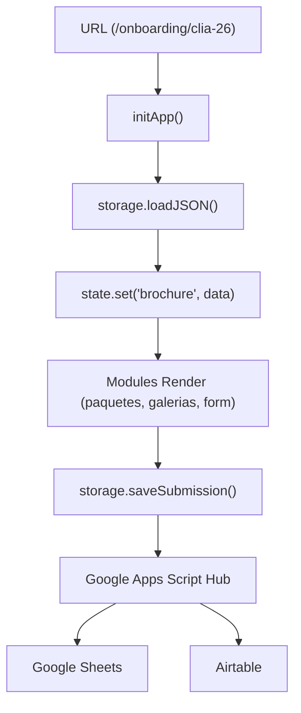

# Arquitectura — Mi Mejor Retrato School Proposals

## Principio central

> El sistema no tiene archivos HTML por colegio en onboarding. Un solo `index.html` lee la URL para saber qué datos mostrar. En propuestas, se mantiene una estructura híbrida optimizada para máxima velocidad y conversión.

Un solo HTML funciona para cualquier escuela/año en onboarding porque **todo el contenido se define en los JSONs**. En el brochure de propuestas (`/propuesta/`), se utiliza un modelo **híbrido** de alto desempeño.

---

## Capas del sistema

Existen dos modalidades principales en la aplicación:
1. **Onboarding Pre-Sesión (B2C)**: Completamente montado vía Javascript (Dynamic Layout).
2. **Propuesta Comercial (B2B)**: Usa un modelo **Híbrido Estático/Dinámico** (HTML fijo inyectando datos).

### Arquitectura Onboarding B2C (Dinámica)
```
┌─────────────────────────────────────────────────────┐
│                   HTML (View)                        │
│                   index.html                         │
│  — Único punto de entrada                            │
│  — Estructura semántica + placeholders               │
│  — NO lógica de negocio, NO fetch directo            │
└──────────────────────┬──────────────────────────────┘
```

### Arquitectura Propuesta B2B (Híbrida/Dinámica)
```
┌─────────────────────────────────────────────────────┐
│                   HTML (View)                        │
│                   propuesta/index.html               │
│  — Mantiene copy, FAQ y logística                    │
│  — Inyecta precios, escuela, año y tabla de precios │
│    vía app.js (cero contenido hardcodeado)           │
│  — Diseño Mobile-First con variables CSS en :root    │
│  — Enfocada en SEO, LLMs y carga veloz               │
└─────────────────────────────────────────────────────┘
```
                       │ llama a
┌──────────────────────▼──────────────────────────────┐
│                   MÓDULOS (/modules)                  │
│  form-renderer.js  paquetes.js  galerias.js          │
│  secciones.js      ubicacion.js  analytics.js        │
│  — Renderizado de UI                                  │
│  — Leen de state, llaman a storage                   │
│  — paquetes.js ahora renderiza una tabla comparativa  │
│    idéntica a la propuesta comercial (Unified UX)    │
└──────────────────────┬──────────────────────────────┘
                       │ usa
┌──────────────────────▼──────────────────────────────┐
│                   ESTADO (lib/state.js)               │
│  — Store centralizado en memoria                     │
│  — Fuente de verdad en runtime                       │
│  — Sin reactividad compleja                          │
└──────────────────────┬──────────────────────────────┘
                       │ poblado por
┌──────────────────────▼──────────────────────────────┐
│              PERSISTENCIA (lib/storage.js)            │
│  — ÚNICO punto de acceso a datos externos            │
│  — Adapter pattern: POST a Google Sheets & Discord   │
└──────────────────────┬──────────────────────────────┘
                       │ lee / escribe
┌──────────────────────▼──────────────────────────────┐
│                   DATOS & BACKEND                    │
│  DATOS (JSON): precios, secciones, propuesta
│  — precios.json: Única Fuente de Verdad para la
│    identidad, visibilidad, precios, inclusiones y
│    fotos familiares
│  — {code}_propuesta.json: contenido B2B específico
│    por colegio (logística, diferenciadores, galería)
│  BACKEND: Google Sheets (DB + Tracker B2B) + Discord
└─────────────────────────────────────────────────────┘
```

---

## 📊 La Tabla Comparativa Unificada y Única Fuente de Verdad

Con el fin de eliminar la redundancia de precios (DRY), la tabla de precios comparativa se construye 100% dinámicamente desde `precios.json` en ambas modalidades (B2B propuesta y B2C onboarding).

### Estructura del JSON (`onboarding/data/precios.json`):
Cada paquete en una escuela activa (con `visibilidad: "publicar"`) expone un objeto `tabla_comparativa` que define exactamente qué se incluye:
```json
"tabla_comparativa": {
  "fotos_digitales": 6,
  "foto_grupal": true,
  "impresiones": "1 gr. + 4 peq.",
  "foto_enmarcada": null,
  "fotos_familiares": false,
  "ideal_para": "Variedad con foto impresa"
}
```
* **Flexibilidad Logística**: El campo `fotos_familiares` (booleano) permite desactivar dinámicamente las fotos con acudientes por escuela (ej: `false` en sesiones escolares en horas de clase de `lasa`, `enda` o `ebrv`, y `true` en sesiones de estudio independiente como `indp`).
* **Inserción Limpia en el DOM**: Para evitar que un contenedor intermedio rompa el comportamiento de `display: grid` en la tabla de 4 columnas, el JS inyecta las celdas directamente en el contenedor `.pt-grid` usando `insertAdjacentHTML('beforeend', ...)`. En el onboarding, se fuerza el contenedor contenedor principal a `display: block` para evitar el colapso del ancho debido al scroll horizontal (`overflow-x: auto`).

---

## 🎨 Sistema de Diseño CSS & Tokens (`propuesta/css/style.css`)
Las propuestas utilizan un sistema de diseño mobile-first sustentado en variables CSS (`:root`):
* **Tipografías Editoriales**: `Playfair Display` (serif estilizado para headings con itálicas expresivas) y `Outfit` (sans-serif moderno para lectura).
* **Paleta Cálida Neutra**:
  * `--color-paper-warm` (`#FBF9F6`) - Fondo orgánico y suave.
  * `--color-accent` (`#C8622A`) - Terracota cálido de marca.
  * `--color-accent-light` (`#F2E8E0`) - Fondo suave para áreas destacadas.
  * `--color-ink` (`#2A2724`) - Negro carbón de gran contraste para lectura.
* **Componentes Robustos**:
  * **Tabla Comparativa**: Contenedor horizontal con scroll nativo (`.pricing-table-wrapper`) que no altera las filas, manteniendo visualización impecable sin desbordamientos de columnas en pantallas pequeñas.
  * **Línea de Tiempo**: Bloques sencillos y limpios que mantienen su alineación y altura fluidamente.

---

## 🏗️ Estructura del Core Unificado (`js/core/`)

Para evitar duplicidad y asegurar que un cambio en la configuración (ej: endpoints o WhatsApp) se refleje en todo el sitio, hemos centralizado la lógica en la raíz del proyecto:

* **`config.js`**: Única fuente de verdad para endpoints, feature flags y textos de marca.
* **`state.js`**: Observable Store centralizado.
* **`storage.js`**: Adaptador de persistencia y carga de JSONs con caché de memoria.
* **`api.js`**: Hub de comunicaciones externas (Google Sheets Hub y Discord).
* **`validators.js`** / **`utils.js`**: Librerías de lógica pura compartidas.

---

## 📋 Tracker de Propuestas B2B (`onboarding/apps-script/MMR_brochures_hub_v4.0.gs`)

El Hub v4.0 incorpora un módulo de CRM interno para hacer seguimiento de las propuestas enviadas a directores/coordinadores de colegios. Opera de forma **independiente** del flujo B2C (padres de familia).

### Pestaña `Propuestas` en Google Sheets

| Columna | Campo | Automatización |
|---------|-------|----------------|
| A | Escuela | Manual |
| B | Código | Manual |
| C–F | Tipo, Zona, Modalidad, Grados | Manual |
| G–I | Contacto, Cargo, WhatsApp | Manual |
| J | Fecha envío | Auto — `marcarEnviadaHoy()` |
| K | Fecha seguimiento | Auto — J + 7 días |
| L | Estado | Auto inicial / actualización manual |
| M | Probabilidad | Manual (Alta / Media / Baja) |
| N | Notas | Manual |

### Funciones del módulo
* **`setupPropostasSheet()`**: Crea e inicializa la pestaña con formato, validaciones y anchos. Ejecutar una sola vez.
* **`marcarEnviadaHoy()`**: Acción de menú. Rellena J, K y cambia Estado a 🟡 Enviada en la fila seleccionada.
* **`verificarSeguimientos()`**: Trigger diario (8am). Colorea filas vencidas (🔴) o próximas (🟡) y envía resumen a Discord. Fallback a email.
* **`setupTrackerTrigger()`**: Registra el trigger diario una sola vez. Elimina duplicados automáticamente.

> ⚠️ **Restricción de contexto**: `getUi()` solo está disponible cuando la ejecución proviene del menú de Google Sheets. Las funciones de setup usan `Logger.log()` para ser compatibles con el editor de Apps Script.

---

## 🔄 Flujo de Datos (Onboarding B2C)



---

## La regla más importante

**La UI nunca toca localStorage ni fetch directamente.**

```javascript
// ✅ CORRECTO — todo pasa por storage y api
const precios = await storage.loadJSON('precios.json');
await storage.saveSubmission(formData, metadata);

// ❌ PROHIBIDO — acoplamiento directo
localStorage.setItem('data', JSON.stringify(data));
const res = await fetch('/data/precios.json');
```

---

## 📱 Herramientas Locales: Pulso (WhatsApp CRM)

El sistema incluye **Pulso** (`herramientas/wassap-crm`), un CRM local sin servidor que se encarga de la Fase inicial del embudo (Outreach). 

*   **Generación de Claves (student_id)**: Pulso limpia los números de teléfono e inyecta dinámicamente un `student_id` único en su variable `[link_onboarding]`.
*   **Persistencia Local**: Funciona exclusivamente con la File System Access API guardando estado en JSONs locales, garantizando la privacidad.
*   **Exportador CSV Nativo**: Se integró un menú personalizado en Google Sheets (`📤 Exportar para Pulso`) dentro del Google Apps Script Hub que formatea, mapea y descarga los leads directamente en el formato exacto de importación requerido por Pulso (Acudiente, Relación, Teléfono, Estudiante, Salón, Escuela).
*   **Flujo**: Onboarding recibe Leads -> Sheets agrupa y exporta CSV por Salón -> Pulso genera el link y campaña -> Acudiente abre el cuestionario de Discovery y luego selecciona Agenda.

---

## Inicialización de Google Analytics en Propuestas B2B

Para mantener la legibilidad de los reportes en Google Analytics 4 (GA4) y evitar que todas las propuestas registren el título genérico del HTML (`Propuesta — Mi Mejor Retrato`), el sistema utiliza una estrategia de **Disparo Asíncrono Retrasado**.

### Flujo de Monitoreo Multi-Colegio
El sistema consolida el rastreo mediante una sola propiedad GA4 (`G-6H4H52RL0T`):
1. El usuario navega a la URL específica mediante Vercel (ej: `/propuesta/lasa-26`).
2. El script inline en `<head>` carga la librería gtag, pero **no** dispara el hit de configuración (`gtag('config')`).
3. `app.js` extrae el `schoolId` (soportando tanto Query Strings como URLs limpias de Vercel).
4. `app.js` lee `precios.json` (sección `escuelas`), actualiza el `document.title` dinámicamente (ej: `Propuesta: Colegio La Salle`).
5. Finalmente, `app.js` dispara el evento de GA4, enviando el `page_title` legible y la dimensión personalizada `school_id`.
