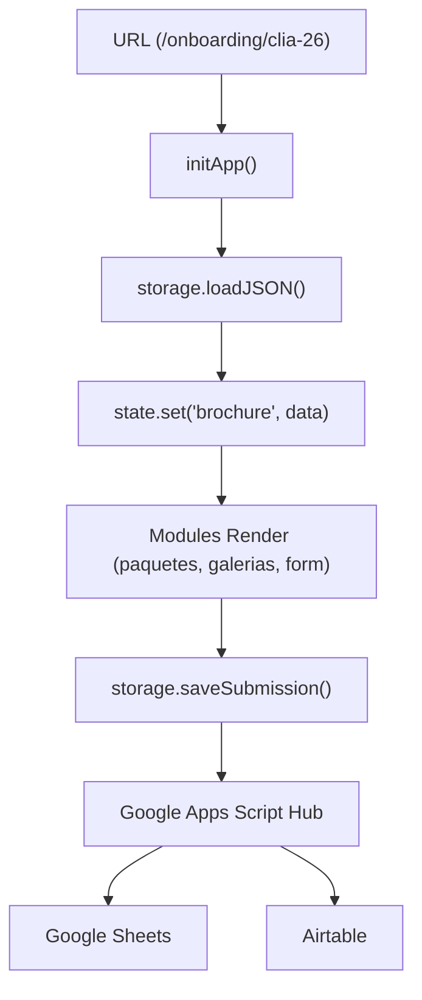

# Arquitectura — Mi Mejor Retrato School Proposals

## Principio central

> El sistema no tiene archivos HTML por colegio. Un solo `index.html` lee la URL para saber qué datos mostrar.

Un solo HTML funciona para cualquier escuela/año porque **todo el contenido se define en los JSONs**. Agregar un nuevo brochure no requiere tocar código, solo agregar datos.

---

## Capas del sistema

```
┌─────────────────────────────────────────────────────┐
│                   HTML (View)                        │
│                   index.html                         │
│  — Único punto de entrada                            │
│  — Estructura semántica + placeholders               │
│  — NO lógica de negocio, NO fetch directo            │
└──────────────────────┬──────────────────────────────┘
                       │ llama a
┌──────────────────────▼──────────────────────────────┐
│                   MÓDULOS (/modules)                  │
│  form-renderer.js  paquetes.js  galerias.js          │
│  secciones.js      ubicacion.js  analytics.js        │
│  — Renderizado de UI                                  │
│  — Leen de state, llaman a storage                   │
└──────────────────────┬──────────────────────────────┘
                       │ usa
┌──────────────────────▼──────────────────────────────┐
│                   ESTADO (lib/state.js)               │
│  — Store centralizado en memoria                     │
│  — Fuente de verdad en runtime                       │
│  — Sin reactividad automática (simple a propósito)   │
└──────────────────────┬──────────────────────────────┘
                       │ poblado por
┌──────────────────────▼──────────────────────────────┐
│              PERSISTENCIA (lib/storage.js)            │
│  — ÚNICO punto de acceso a datos externos            │
│  — Adapter pattern: POST a Google Sheets & Discord   │
│  — Fallback: solo logs (descarga local desactivada)  │
└──────────────────────┬──────────────────────────────┘
                       │ lee / escribe
┌──────────────────────▼──────────────────────────────┐
│                   DATOS & BACKEND                    │
│  DATOS (JSON): escuelas, precios, secciones          │
│  BACKEND: Google Sheets (DB) + Discord (Alertas)     │
│  — Sin servidor propio (Serverless)                  │
└─────────────────────────────────────────────────────┘
```

## 🏗️ Estructura del Core Unificado (`js/core/`)

Para evitar duplicidad y asegurar que un cambio en la configuración (ej: webhook de Discord o WhatsApp) se refleje en todo el sitio, hemos centralizado la lógica en la raíz del proyecto:

- **`config.js`**: Única fuente de verdad para endpoints, feature flags y textos de marca. Usado por el website y los brochures.
- **`state.js`**: Observable Store centralizado. 
    - *Nota de compatibilidad*: Para permitir que los módulos de onboarding (legacy) funcionen sin cambios, los datos como `brochure`, `pricing`, `form` y `sections` residen en la raíz del estado. El estado del website está bajo el namespace `website`.
- **`storage.js`**: Adaptador de persistencia y carga de JSONs con caché de memoria. Incluye métodos de negocio delegados (`saveSubmission`, `notifyDiscord`) para compatibilidad con los módulos existentes.
- **`api.js`**: Hub de comunicaciones externas (Google Sheets Hub y Discord).
    - *Optimización CORS*: Detecta si el destino es Google Apps Script para usar `text/plain` y evitar errores de preflight, mientras mantiene `application/json` para Discord.
- **`validators.js`** / **`utils.js`**: Librerías de lógica pura compartidas y robustecidas.

## 🔄 Flujo de Datos (Onboarding)



---

## La regla más importante

**La UI nunca toca localStorage ni fetch directamente.**

```js
// ✅ CORRECTO — todo pasa por storage y api
const precios = await storage.loadJSON('precios.json');
await storage.saveSubmission(formData, metadata);

// ❌ PROHIBIDO — acoplamiento directo
localStorage.setItem('data', JSON.stringify(data));
const res = await fetch('/data/precios.json');
```

Esta regla es lo que permite migrar de JSONs estáticos a una API real **sin reescribir un solo módulo de UI**.

---

## Autoconfiguración del brochure

URL: /onboarding/ebrv-26
     │
     ▼
extractBrochureConfig()
     │ location.pathname.match(/([a-z]{4})-(\d{2})/)
     ▼
{ code: 'ebrv', year: 26, id: 'ebrv-26' }
     │
     ▼
escuelas.json → busca code === 'ebrv' && years.includes(26)
     │
     ▼
state.set('brochure', { code, year, id, schoolName, gaId, estado })
     │
     ▼
todos los módulos leen state.get('brochure')

**Implicación práctica:** no hay archivos HTML duplicados. El enrutamiento es dinámico basado en el slug de la URL.

### Inyección Dinámica de Contenido
Además de la configuración, el sistema inyecta strings dinámicos en el DOM durante `initBrochure()`:
- **Hero Title**: `Fotografía escolar · [Escuela] · [Año]`
- **Hero Proposal**: `Propuesta preparada para: [Escuela] [Año]` (debajo del subtítulo).
- **Page Title**: `Mi Mejor Retrato — [Escuela] [Año]`

---

## Estado global (state.js)

El state tiene claves fijas y predecibles:

```js
state.get('brochure')  // { code, year, id, schoolName, gaId, estado }
state.get('form')      // definición del formulario (formulario.json)
state.get('pricing')   // precios por escuela (precios.json)
state.get('sections')  // secciones activas (ebrv_secciones.json)
state.get('schools')   // catálogo de colegios (escuelas.json)
state.get('ui')        // { formLoading, pricingLoading, sectionsLoading }

// ── Post-Onboarding (Fase 1: Cuestionario) ──
state.get('student')       // datos del estudiante pre-cargados desde onboarding
state.get('questionnaire') // definición del cuestionario activo (cuestionario_kinder.json, etc.)
```

Regla: **si un módulo necesita datos, los pide a `state`, no los carga él mismo**.

---

## Flujo de inicialización

```
initApp()
  ├── 1. initBrochure()    → carga escuelas.json, valida slug, setea state.brochure
  ├── 2. loadAppData()     → carga formulario + precios + secciones en paralelo
  ├── 3. seccionesModule.init()   → muestra/oculta secciones del DOM
  ├── 4. Promise.all([            → renderizado paralelo
  │       galeriasModule.init()
  │       paquetesModule.render()
  │       ubicacionModule.render()
  │       formModule.init()
  │     ])
  ├── 5. initReveal()      → IntersectionObserver para animaciones
  └── 6. initAnalytics()   → usa gaId de state.brochure, inicializa GA
```

---

## Configuración centralizada (`js/core/config.js`)

Un único objeto `config` expone:

| Sección | Qué contiene |
|---------|-------------|
| `config.isDev / isProd` | detección de ambiente |
| `config.endpoints` | URLs del Google Apps Script Hub |
| `config.whatsapp` | número y template de mensaje |
| `config.analytics` | GA ID por defecto y nombres de eventos |
| `config.ui` | duración de animaciones, thresholds |
| `config.validation` | reglas de validación de campos |
| `config.features` | feature flags (googleContacts, discord, etc.) |
| `config.messages` | textos de error y éxito |

**Regla:** cualquier string que pueda cambiar va en `config`, no hardcodeado.

---

## JSONs de datos — responsabilidad de cada uno

| Archivo | Editado cuándo |
|---------|---------------|
| `escuelas.json` | Al agregar un colegio nuevo o año activo (incluye ga_id) |
| `precios.json` | Al cambiar precios o paquetes |
| `formulario.json` | Al agregar/quitar campos del formulario |
| `{code}_secciones.json` | Al activar/desactivar secciones (layout) por escuela |
| `cuestionario_kinder.json` | Al cambiar preguntas del cuestionario pre-sesión (kinder/pre-k) |
| `cuestionario_sexto.json` | Al cambiar preguntas del cuestionario pre-sesión (sexto grado) |
| `cuestionario_config.json` | Al mapear qué salones usan qué tipo de cuestionario |

---

## 🏛️ La Regla de Oro de Visibilidad

Para evitar conflictos entre el diseño y la lógica de negocio, se ha dividido la autoridad:

1.  **Layout (ON/OFF)** → Se controla en `*_secciones.json`. Si una sección como `faq` o `sobre_mike` debe desaparecer, se usa `activo: false` allí.
2.  **Lógica de Paquetes (Precios)** → Se controla ÚNICAMENTE en `precios.json` mediante el campo `visibilidad`.
    *   `publicar`: Todo visible.
    *   `pendiente`: Muestra aviso de "coordinando precios".
    *   `no_publicar`: Oculta la sección pero permite enviar el formulario con el paquete #1 preseleccionado.

Esta separación garantiza que el `paquetes.js` pueda manejar lógica compleja de ventas sin interferir con el `secciones.js` que solo apaga interruptores.

---

## Pipeline Post-Onboarding

El sistema se extiende más allá del brochure/reserva con un pipeline de 4 fases, todas compartiendo el mismo `js/core/`:

```
FASE 0 (✅ HECHO)              FASE 1 (🎯 PRÓXIMO)       FASE 2                    FASE 3
Onboarding                     Cuestionario              Producción                Operaciones
─────────────────              ──────────────            ──────────────            ──────────────
Brochure URL-driven            Formulario pre-sesión     PDF referencia            Panel de horarios
  → Formulario reserva           personalizado por niño    para el fotógrafo         por salón/escuela
  → Google Sheets              → Links por WhatsApp      Banner + QR code
  → Airtable                   → Mismo Sheets/Airtable     para ID de fotos
  → Google Contacts            → Preguntas condicionales Python QR reader
  → Discord
```

### student_id — La clave universal

Todos los módulos post-onboarding se conectan a través de un identificador único por estudiante:

```
student_id = {whatsapp_limpio}_{nombreEstudiante_slug}_{salon_slug}
Ejemplo:    5076XXXXXXX_maria-antonia_kinder
```

Este ID se genera en el onboarding y se envía al Hub dentro del objeto `_meta` y también en la raíz del payload para asegurar su persistencia en Sheets y Airtable. Se usa como clave para:
- Cuestionario pre-sesión (Fase 1) → URL personalizado con `?sid={student_id}`
- PDF + QR (Fase 2) → QR codifica el student_id
- Panel de horarios (Fase 3) → filtra slots por student_id

### Cuestionario Pre-Sesión (Fase 1)

```
URL: /propuesta/cuestionario?sid={student_id}
     │
     ▼
cuestionario.html (único, URL-driven como el brochure)
     │ lee query param `sid`
     ▼
Apps Script Hub lookup → obtiene datos del onboarding (nombre, escuela, salón)
     │
     ▼
state.set('student', { nombre, escuela, salon, grado, ... })
     │
     ▼
Renderiza cuestionario condicional:
  ├── Kinder / Pre-K  → cuestionario_kinder.json
  ├── 6to grado       → cuestionario_sexto.json
  └── Mapeo definido en cuestionario_config.json
     │
     ▼
Submit → Apps Script Hub → Sheets (pestaña "Cuestionarios") + Airtable (misma fila)
```

---

## Qué NO existe aquí (a propósito)

| Ausente | Por qué |
|---------|---------|
| Build step / bundler | Fricción innecesaria para apps estáticas simples |
| TypeScript | Overhead para un proyecto de un solo dev |
| Framework (React/Vue) | El DOM manipulation manual es suficiente y más debuggeable |
| Estado reactivo complejo | La inicialización secuencial es más predecible |
| Testing automatizado | Complejidad no justificada para este escenario |
| Base de datos SQL/NoSQL | Google Sheets + Airtable cubren el volumen actual y permiten gestión visual |

La complejidad se agrega **cuando el problema lo exige**, no antes.
